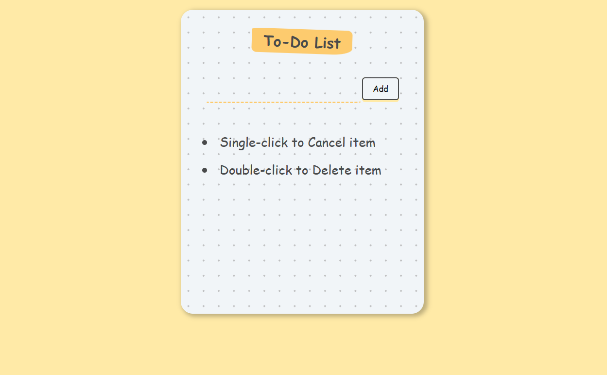

# To-Do List App

This is a simple To-Do List application built with React.

## Screenshots

## Features

- Add new items to the to-do list.
- Mark items as completed by clicking on them.
- Delete items by double-clicking on them.

## Getting Started

1. Clone this repository.
2. Install dependencies by running `npm install`.
3. Start the development server with `npm start`.

## Usage

- Type your to-do item in the input field and press Enter or click "Add".
- Single-click on an item to mark it as completed (line-through).
- Double-click on an item to delete it.

## Technologies Used

- React
- PropTypes